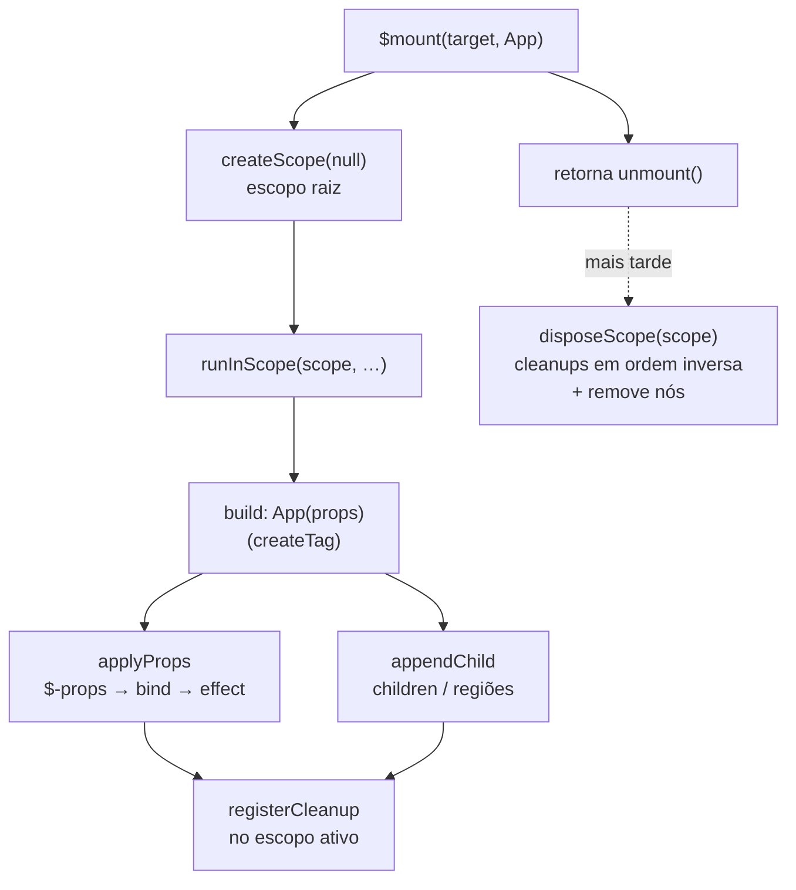

# mini-q — Arquitetura (como funciona + onde mora)

> Para *usar*, veja [USAGE.md](USAGE.md) · para *os nomes*, [GLOSSARY.md](GLOSSARY.md) · para *por que
> a API é assim*, [DX-MANIFESTO.md](DX-MANIFESTO.md). Este documento é o **mapa mental** que liga tudo:
> como uma árvore ganha vida e morre (o fluxo de `$mount` até `unmount`, e onde reatividade e cleanup
> se encaixam) e como o `src/` é organizado (o padrão que guia onde cada coisa mora).

---

# Parte I — Como o runtime flui

## 1. Modelo mental

Você passa um **builder** — um componente ou uma função que *constrói* a árvore — e **não** uma
árvore pronta. O motivo é lifecycle: a construção precisa rodar **dentro de um escopo (owner)**
para que todo effect/listener criado no caminho tenha um dono que saiba limpá-lo depois. Uma
árvore pré-construída fora de um escopo cria effects órfãos.

O objeto raiz `$` ([src/index.ts](../src/index.ts)) **só compõe as slices** — ele não implementa
regra. Cada assunto (element, events, style, reactive, lifecycle…) é uma fatia autocontida.

## 2. A espinha: `mount → escopo → build → unmount`



- [`mount`](../src/mount.ts) abre o **escopo raiz** (`createScope(null)`), roda o builder dentro
  dele (`runInScope`), anexa o resultado ao alvo com `appendChild`, e devolve `unmount`.
- [`lifecycle`](../src/lifecycle.ts) mantém o **escopo ativo** (`current`). Qualquer coisa que
  registre limpeza chama `registerCleanup`, que anexa ao escopo ativo. `disposeScope` roda os
  cleanups **em ordem inversa** (e engole erros por cleanup, sem abortar os demais).
- Regiões e componentes aninhados abrem **sub-escopos** — o `unmount` da raiz cascateia.
- **Hooks públicos** [`onMounted`/`onUnmounted`](../src/lifecycle.ts) leem esse mesmo escopo ativo:
  `onUnmounted` é um `registerCleanup` fino; `onMounted(fn)` roda `fn` no build e, se ele retornar
  função, registra-a como teardown. Fora de escopo **avisam** (`warn`) — o footgun do effect órfão.
  Um **behavior** (`use`) é o mesmo composable **com elemento** (recebe `ctx.element`); seu teardown
  interno usa `registerCleanup` (silencioso), não os hooks que avisam.

## 3. Construção do elemento (slice `element/`)

[`createTag`](../src/element/create.ts) tem assinatura dupla:

- **Forma setup** — 1º arg é função com **≥1 param**: devolve um **componente** `(props) => Element`;
  a closure só roda no build (é aí que os effects nascem sob o escopo certo). Função **0-param** é
  **filho reativo** (açúcar sem `{}` — a aridade desambigua).
- **Forma elemento** — `createTag(tag, props?, ...children)`: aplica props e anexa filhos agora.

[`applyProps`](../src/element/props.ts) percorre as props uma vez. Chaves especiais têm caminho
próprio — `class`/`$class`, `style`/`$style`, `data`/`$data`, `on`, `use`, `key` — e qualquer
chave com **`$`-prefixo** (`$disabled`, `$value`…) vira atributo/propriedade **reativa** via
`bind`. O resto é atributo estático (`setAttr`: propriedade se existir no elemento, senão
`setAttribute`).

## 4. Reatividade (slice `reactive`)

A lib é **agnóstica de signal**: o usuário instala um [adapter](../src/reactive.ts) mínimo com
`$useSignal({ isSignal, getValue, effect, untrack?, signal? })`. Um valor reativo (**Bindable**)
é um signal **ou** uma função `() => expr` — esta funciona com qualquer adapter (só depende de
`effect`).

O elo entre reatividade e DOM é **um só**:

```
bind(source, apply):
  se source é reativo → effect(() => apply(read(source)));  registerCleanup(stop)
  senão               → apply(source)   // uma vez
```

Ou seja: **todo binding reativo é um `effect` cujo `stop` é registrado no escopo ativo.** Quando o
escopo é descartado, o effect para. É esse casamento `effect + registerCleanup` que faz o
`unmount` limpar tudo sem rastrear nós individualmente.

## 5. Children e regiões reativas (slice `element/`)

[`appendChild`](../src/element/children.ts) normaliza qualquer filho: `null/false/true` somem,
Node entra direto, array recursa, primitivo vira texto, `[Component, props]` é chamado, e uma
**fonte reativa** (signal|função) vira uma **região**.

[`mountReactiveRegion`](../src/element/region.ts) planta uma **âncora** (comment node) e, a cada
mudança da fonte, reconcilia:

- Itens com **tupla de componente** são **keyed** (reuso por `key ?? props`); os demais são
  **volatile** (recriados a cada passada).
- A **construção da subárvore roda destrastreada** (`untrack`): signals lidos ao montar um item
  **não** viram dependência da região — senão mudar um signal interno remontaria a lista inteira.
  (Este era o *bug 1/1b* — ver [region.test.ts](../src/element/__tests__/region.test.ts).)
- O reconcile **move só nós fora de posição** (comparando `nextSibling`) e, se um nó reusado que
  estava focado precisou mover, **restaura o foco**. (Era o *bug 2*.)

## 6. Control-flow: `when`

[`when(cond, then, else?)`](../src/element/control.ts) devolve uma função-região. Só a `cond` é
rastreada; os ramos são construídos com `untrack`. Como é uma função, entra numa posição de filho
e é governada pela mesma maquinaria de região da seção 5. (Os irmãos `match`/`switch`/`else`
vivem no mesmo [control.ts](../src/element/control.ts).)

## 7. Como estilo e breakpoints se encaixam

Estilo e breakpoints **saíram do core** para o entry opcional `mini-q/style` (não são manipulação
direta de DOM). O core só sabe do brand `STYLE_HANDLE` (em `types.ts`), então `class`/`$class`/`$cx`
seguem aceitando handles mesmo com o engine à parte.

- **Estilo** ([slice `style/`](../src/style)): `style(nome, config)` (de `mini-q/style`) injeta CSS e
  devolve um **StyleHandle** callable. No fluxo acima ele aparece em `class`/`$class`/`$cx` — que
  **chamam** o handle (branded por `STYLE_HANDLE`) e resolvem para a string de classes. Vocabulário
  completo no GLOSSARY (§Estilo).
- **Breakpoints** ([style/config](../src/style/config.ts) + [style/media](../src/style/media.ts)):
  `config` registra medias nomeadas; `resolveMedia` traduz `@md` no CSS (via emit) **e** alimenta
  `media`, que é um signal booleano de `matchMedia` com cleanup no escopo — reatividade pela mesma
  via da seção 4.

---

# Parte II — Como o `src/` é organizado

## 8. O padrão: colocation + feature-sliced

Duas ideias governam tudo:

1. **Colocation** — o que muda junto, mora junto. **Tipos, utils, testes e afins vivem na
   mesma pasta da feature**, não em árvores paralelas (`types/` global, `__tests__/` à parte).
   Abrir a pasta de um assunto deve mostrar *tudo* dele.
2. **Feature-sliced** — cada subsistema é uma **slice** (fatia) autocontida com uma **superfície
   pública única** (o barril `index.ts`). O resto é interno à slice.

O objeto raiz `$` (`src/index.ts`) só **compõe as slices** — não implementa regra de negócio.

## 9. Anatomia de uma slice

Uma slice é uma pasta cujo `index.ts` é a única porta de entrada. Dentro, os arquivos são
nomeados pelo **papel**, não por tipo genérico:

```
src/style/
  index.ts     ← barril: a superfície pública (o que o resto do app importa)
  emit.ts      ← motor: objeto JS → CSS → injeção no DOM
  build.ts     ← lógica de domínio: style(name, config) → StyleHandle
  types.ts     ← contrato público da slice (colocado, não global)
```

Regras:

- **Imports externos apontam para o barril** (`from './style'`), **nunca** para o interior
  (`from './style/build'`). O interior pode ser refatorado à vontade sem quebrar ninguém.
- **Dentro da slice**, os arquivos importam uns dos outros por caminho direto (`./emit`, `./types`).
- **Tipos da slice** ficam em `types.ts` **dentro** dela. Só sobe para um lugar comum o que é
  genuinamente compartilhado por várias slices.
- **Utils** de uma slice ficam na slice. Um util só migra para um lugar comum quando um **segundo**
  consumidor real aparece (evitar abstração especulativa).
- **Testes colocados**: `x.test.ts` ao lado de `x.ts` (ou um `__tests__/` **dentro** da slice).

## 10. Quando promover arquivo → pasta

Comece simples. Um módulo nasce como **arquivo solto** (`reactive.ts`, `mount.ts`). Ele vira
**pasta/slice** quando cruza qualquer um destes limiares:

- passa a ter **mais de uma preocupação** separável (ex.: emissão vs. build vs. tipos);
- ganha **tipos próprios não triviais** + **utils** + **testes** que se beneficiam de morar juntos;
- o arquivo único fica grande o bastante para que "onde está X?" deixe de ser óbvio.

Promover = criar a pasta, quebrar por papel, adicionar `index.ts` reexportando a superfície que
já existia. Como o import externo era `./style`, ele **continua resolvendo** para `./style/index.ts`
— a promoção é invisível para quem consome. Foi exatamente assim que `style.ts` virou `style/`.

Não promova só por estética: um arquivo coeso de 80 linhas não precisa de pasta.

## 11. O mapa atual

| Slice / módulo | Forma | Papel |
|---|---|---|
| `element/` | slice (create/props/children/region/control/guards + barril) | construção de nós: `createTag` + props + children + região keyed + `when` |
| `style/` | slice + entry `mini-q/style` (emit/build/config/media/types + barril) | CSS `style` namespace + breakpoints (`config`/`media`) — **fora do core** |
| `events/` | slice (handle/apply/custom/types + barril) | eventos + custom events + `handle` |
| `dom/` | pasta (só `nodes.ts`) | primitivas de nó/`cx` |
| `adapters/` | pasta (só `preact.ts`) | adapters de signal |
| `reactive.ts` | arquivo | contrato de reatividade (adapter) |
| `mount.ts` / `lifecycle.ts` | arquivos | escopo de montagem/cleanup |
| `behaviors.ts` | arquivo | `model`/`show` (`use`) |
| `types.ts` | arquivo (global) | tipos de View compartilhados (`Props`, `Child`, …) |
| `index.ts` | raiz | barril: `$` (tags) + os `$`-helpers nomeados |

## 12. Navegação: etapa do fluxo → módulo → símbolos

| Etapa do fluxo | Módulo | Símbolos |
|---|---|---|
| Barril público (`$` tags + `$`-helpers) | [index.ts](../src/index.ts) | `$` (tags), `$mount`, `$when`, `$handle`, `$model`, `$useSignal`, … |
| Montar/desmontar | [mount.ts](../src/mount.ts) | `mount` → `unmount` (`$mount`) |
| Escopo & cleanup | [lifecycle.ts](../src/lifecycle.ts) | `createScope`, `runInScope`, `registerCleanup`, `disposeScope`, `onMounted`, `onUnmounted` |
| Contrato reativo | [reactive.ts](../src/reactive.ts) | `useSignal` (`$useSignal`), `bind`, `read`, `untrack`, `isReactive` |
| Criar tag | [element/create.ts](../src/element/create.ts) | `createTag` (dual) |
| Aplicar props | [element/props.ts](../src/element/props.ts) | `applyProps` (+ `$`-prefixo) |
| Anexar filhos | [element/children.ts](../src/element/children.ts) | `appendChild` |
| Região keyed | [element/region.ts](../src/element/region.ts) | `mountReactiveRegion` |
| Control-flow | [element/control.ts](../src/element/control.ts) | `when` (+ `match`/`switch`/`else`) |
| Predicados locais | [element/guards.ts](../src/element/guards.ts) | `isComponentTuple`, `isProps` |
| Nós & classes | [dom/nodes.ts](../src/dom/nodes.ts) | `isNode`, `toNodes`, `resolveClass`, `cx`, `getElement` |
| Eventos | [events/](../src/events) | `handle`, `applyEvents`, custom events |
| Behaviors (`use`) | [behaviors.ts](../src/behaviors.ts) | `applyUse`, `model`, `show` |
| Estilo (CSS) — entry `mini-q/style` | [style/](../src/style) | `style`, `StyleHandle`, `emit` |
| Breakpoints — entry `mini-q/style` | [style/config.ts](../src/style/config.ts) · [style/media.ts](../src/style/media.ts) | `config`, `resolveMedia`, `media` |
| Tipos de View | [types.ts](../src/types.ts) | `Props`, `Child`, `Component`, `MQ`, `STYLE_HANDLE` |

> Regra de ouro para navegar: **entra pelo barril** ([index.ts](../src/index.ts) — `$` de tags +
> os `$`-helpers) → o assunto é uma **slice** com barril (`element/`, `events/`, `style/`) ou um
> **arquivo solto** coeso (`reactive`, `lifecycle`, `mount`, `behaviors`). O interior de uma slice
> se importa por caminho direto; de fora, só o barril.

## 13. Débito conhecido (rumo à colocation plena)

Onde a prática ainda não bateu com o princípio — corrigir aos poucos:

- **~~`src/__tests__/` é uma árvore paralela.~~ Resolvido.** Os testes foram colocados: estilo em
  `style/__tests__/`, região em `element/__tests__/`, aceite em `demo/pocketfin.test.ts`, e a suíte
  de integração cross-slice do `$` composto em `src/index.test.ts` (colocada com `index.ts`).
  `src/__tests__/` não existe mais.
- **`src/types.ts` é global.** Parte é genuinamente compartilhada (View/`Props`); se algum tipo
  ali pertence a uma slice só, ele deveria descer para a slice.
- **`config.ts` + `media.ts`** são uma mesma preocupação (breakpoints) espalhada em dois arquivos
  soltos — candidatos a uma slice `breakpoints/` (ou entrar em `style/`, dado o acoplamento via
  `resolveMedia`). `src/media.test.ts` já está colocado no root e entraria na slice.
- **`dom/` e `adapters/` são pastas-de-um sem barril.** Ok enquanto tiverem um arquivo; se
  crescerem, ganham `index.ts` como as demais.
