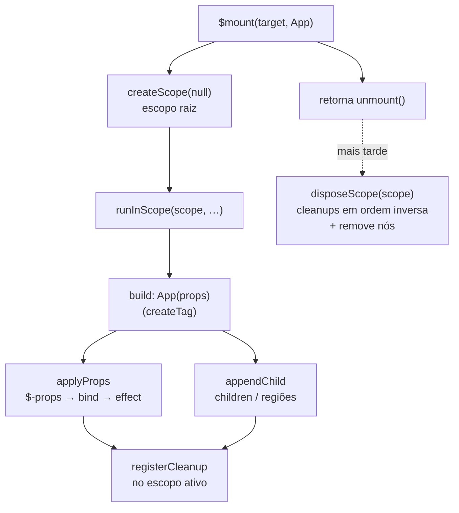

# mini-q — Fluxo fundamental

Como uma árvore ganha vida e morre no mini-q: o caminho de `$mount` até `unmount`, e onde
reatividade e cleanup se encaixam. Para *nomes*, veja [GLOSSARY.md](GLOSSARY.md); para *onde o
código mora*, [STRUCTURE.md](STRUCTURE.md); para *como usar*, [USAGE.md](USAGE.md). Esta doc é o
**mapa mental** que liga tudo.

---

## 1. Modelo mental

Você passa um **builder** — um componente ou uma função que *constrói* a árvore — e **não** uma
árvore pronta. O motivo é lifecycle: a construção precisa rodar **dentro de um escopo (owner)**
para que todo effect/listener criado no caminho tenha um dono que saiba limpá-lo depois. Uma
árvore pré-construída fora de um escopo cria effects órfãos.

O objeto raiz `$` ([src/index.ts](../src/index.ts)) **só compõe as slices** — ele não implementa
regra. Cada assunto (element, events, style, reactive, lifecycle…) é uma fatia autocontida.

## 2. A espinha: `mount → escopo → build → unmount`



- [`mount`](../src/mount.ts) abre o **escopo raiz** (`createScope(null)`), roda o builder dentro
  dele (`runInScope`), anexa o resultado ao alvo com `appendChild`, e devolve `unmount`.
- [`lifecycle`](../src/lifecycle.ts) mantém o **escopo ativo** (`current`). Qualquer coisa que
  registre limpeza chama `registerCleanup`, que anexa ao escopo ativo. `disposeScope` roda os
  cleanups **em ordem inversa** (e engole erros por cleanup, sem abortar os demais).
- Regiões e componentes aninhados abrem **sub-escopos** — o `unmount` da raiz cascateia.
- **Hooks públicos** [`onMounted`/`onUnmounted`](../src/lifecycle.ts) leem esse mesmo escopo ativo:
  `onUnmounted` é um `registerCleanup` fino; `onMounted(fn)` roda `fn` no build e, se ele retornar
  função, registra-a como teardown. Fora de escopo **avisam** (`warn`) — o footgun do effect órfão.
  Um **behavior** (`use`) é o mesmo composable **com elemento** (recebe `ctx.element`); seu teardown
  interno usa `registerCleanup` (silencioso), não os hooks que avisam.

## 3. Construção do elemento (slice `element/`)

[`createTag`](../src/element/create.ts) tem assinatura dupla:

- **Forma setup** — 1º arg é função: devolve um **componente** `(props) => Element`; a closure só
  roda no build (é aí que os effects nascem sob o escopo certo).
- **Forma elemento** — `createTag(tag, props?, ...children)`: aplica props e anexa filhos agora.

[`applyProps`](../src/element/props.ts) percorre as props uma vez. Chaves especiais têm caminho
próprio — `class`/`$class`, `style`/`$style`, `data`/`$data`, `on`, `use`, `key` — e qualquer
chave com **`$`-prefixo** (`$disabled`, `$value`…) vira atributo/propriedade **reativa** via
`bind`. O resto é atributo estático (`setAttr`: propriedade se existir no elemento, senão
`setAttribute`).

## 4. Reatividade (slice `reactive`)

A lib é **agnóstica de signal**: o usuário instala um [adapter](../src/reactive.ts) mínimo com
`$useSignal({ isSignal, getValue, effect, untrack?, signal? })`. Um valor reativo (**Bindable**)
é um signal **ou** uma função `() => expr` — esta funciona com qualquer adapter (só depende de
`effect`).

O elo entre reatividade e DOM é **um só**:

```
bind(source, apply):
  se source é reativo → effect(() => apply(read(source)));  registerCleanup(stop)
  senão               → apply(source)   // uma vez
```

Ou seja: **todo binding reativo é um `effect` cujo `stop` é registrado no escopo ativo.** Quando o
escopo é descartado, o effect para. É esse casamento `effect + registerCleanup` que faz o
`unmount` limpar tudo sem rastrear nós individualmente.

## 5. Children e regiões reativas (slice `element/`)

[`appendChild`](../src/element/children.ts) normaliza qualquer filho: `null/false/true` somem,
Node entra direto, array recursa, primitivo vira texto, `[Component, props]` é chamado, e uma
**fonte reativa** (signal|função) vira uma **região**.

[`mountReactiveRegion`](../src/element/region.ts) planta uma **âncora** (comment node) e, a cada
mudança da fonte, reconcilia:

- Itens com **tupla de componente** são **keyed** (reuso por `key ?? props`); os demais são
  **volatile** (recriados a cada passada).
- A **construção da subárvore roda destrastreada** (`untrack`): signals lidos ao montar um item
  **não** viram dependência da região — senão mudar um signal interno remontaria a lista inteira.
  (Este era o *bug 1/1b* — ver [region.test.ts](../src/element/__tests__/region.test.ts).)
- O reconcile **move só nós fora de posição** (comparando `nextSibling`) e, se um nó reusado que
  estava focado precisou mover, **restaura o foco**. (Era o *bug 2*.)

## 6. Control-flow: `when`

[`when(cond, then, else?)`](../src/element/control.ts) devolve uma função-região. Só a `cond` é
rastreada; os ramos são construídos com `untrack`. Como é uma função, entra numa posição de filho
e é governada pela mesma maquinaria de região da seção 5.

## 7. Como estilo e breakpoints se encaixam

Estilo e breakpoints **saíram do core** para o entry opcional `mini-q/style` (não são manipulação
direta de DOM). O core só sabe do brand `STYLE_HANDLE` (em `types.ts`), então `class`/`$class`/`$cx`
seguem aceitando handles mesmo com o engine à parte.

- **Estilo** ([slice `style/`](../src/style)): `style(nome, config)` (de `mini-q/style`) injeta CSS e
  devolve um **StyleHandle** callable. No fluxo acima ele aparece em `class`/`$class`/`$cx` — que
  **chamam** o handle (branded por `STYLE_HANDLE`) e resolvem para a string de classes. Vocabulário
  completo no GLOSSARY (§Estilo).
- **Breakpoints** ([style/config](../src/style/config.ts) + [style/media](../src/style/media.ts)):
  `config` registra medias nomeadas; `resolveMedia` traduz `@md` no CSS (via emit) **e** alimenta
  `media`, que é um signal booleano de `matchMedia` com cleanup no escopo — reatividade pela mesma
  via da seção 4.

## 8. Onde mora cada peça

| Etapa do fluxo | Módulo | Símbolos |
|---|---|---|
| Barril público (`$` tags + `$`-helpers) | [index.ts](../src/index.ts) | `$` (tags), `$mount`, `$when`, `$handle`, `$model`, `$useSignal`, … |
| Montar/desmontar | [mount.ts](../src/mount.ts) | `mount` → `unmount` (`$mount`) |
| Escopo & cleanup | [lifecycle.ts](../src/lifecycle.ts) | `createScope`, `runInScope`, `registerCleanup`, `disposeScope`, `onMounted`, `onUnmounted` |
| Contrato reativo | [reactive.ts](../src/reactive.ts) | `useSignal` (`$useSignal`), `bind`, `read`, `untrack`, `isReactive` |
| Criar tag | [element/create.ts](../src/element/create.ts) | `createTag` (dual) |
| Aplicar props | [element/props.ts](../src/element/props.ts) | `applyProps` (+ `$`-prefixo) |
| Anexar filhos | [element/children.ts](../src/element/children.ts) | `appendChild` |
| Região keyed | [element/region.ts](../src/element/region.ts) | `mountReactiveRegion` |
| Control-flow | [element/control.ts](../src/element/control.ts) | `when` |
| Predicados locais | [element/guards.ts](../src/element/guards.ts) | `isComponentTuple`, `isProps` |
| Nós & classes | [dom/nodes.ts](../src/dom/nodes.ts) | `isNode`, `toNodes`, `resolveClass`, `cx`, `getElement` |
| Eventos | [events/](../src/events) | `handle`, `applyEvents`, custom events |
| Behaviors (`use`) | [behaviors.ts](../src/behaviors.ts) | `applyUse`, `model`, `show` |
| Estilo (CSS) — entry `mini-q/style` | [style/](../src/style) | `style`, `StyleHandle`, `emit` |
| Breakpoints — entry `mini-q/style` | [style/config.ts](../src/style/config.ts) · [style/media.ts](../src/style/media.ts) | `config`, `resolveMedia`, `media` |
| Tipos de View | [types.ts](../src/types.ts) | `Props`, `Child`, `Component`, `MQ`, `STYLE_HANDLE` |

> Regra de ouro para navegar: **entra pelo barril** ([index.ts](../src/index.ts) — `$` de tags +
> os `$`-helpers) → o assunto é uma **slice** com barril (`element/`, `events/`, `style/`) ou um
> **arquivo solto** coeso (`reactive`, `lifecycle`, `mount`, `behaviors`). O interior de uma slice
> se importa por caminho direto; de fora, só o barril. Detalhes do padrão em [STRUCTURE.md](STRUCTURE.md).
