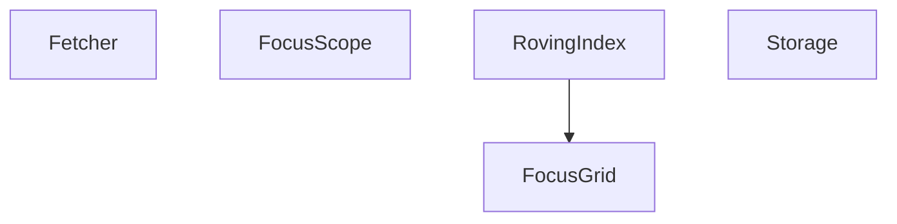

# Roadmap — `$stdbrowser`

Este ficheiro define **como** a pasta cresce e **o que não entra**. Não substitui a leitura dos módulos: é o mapa, o filtro e as regras de escrita.

A documentação humana vive aqui, ao lado do código. Copiar o directório da `$stdbrowser` leva os primitivos e a leitura.

Irmão da [`$stdlib`](../../$stdlib/docs/ROADMAP.md): JS que precisa de DOM / `fetch` / `Response`. A `$stdbrowser` pode depender da `$stdlib`; o contrário não.

---

## Porque esta pasta existe

Helpers de DOM espalham-se pelo host: trap de foco copiado de modal para modal, índice de setas no componente, `fetch` + parse + timeout à mão. Toolkits de UI trazem o *quando* (ciclo do framework, `aria-*`) junto com o *como*. A `$stdbrowser` é o *como* cego: primitivo sem Vue. O host decide o *quando*.

Critério: entra se há dor repetida. **Substitui, não soma.** O critério de admissão — casa única, consumidor vivo, corte da fachada — é transversal às libs e vive registado com a sua jurisprudência: [DX na `$stdlib`](../../$stdlib/docs/DX.md).

---

## Unidade portável

```
src/$stdbrowser/
  <módulo>/     código + testes
  docs/         esta leitura + ROADMAP.md
  README.md     aponta para docs/
```

Import no host: `@/$stdbrowser/...` (alias `@` → `src`). A doc dos módulos **não** trata o alias como parte do contrato.

---

## Como escrever (leitura primeiro)

Narrativa primeiro, tabela depois. Um ficheiro responde a uma pergunta (“como mover o foco numa grelha?”), não lista a pasta do código. Qualidade de prosa: skill `dev-lib-docs`. **Este** ficheiro = processo e filtro. Os módulos documentados não citam a skill.

Exemplos ilustram o contrato (`Fetcher.create()`, `FocusScope.of(dialogEl)`, `FocusGrid.of(root, { columns: 7 })`, `Storage.local.create('prefs', { done: false })`). Não são um tour nesta SPA.

Cada README de módulo já documentado:

1. **Papel** + **em vez de** — o padrão solto (`fetch` à mão, trap no jQuery, índice no SFC).
2. **Situação** em prosa **antes** do primeiro bloco — diálogo, lista 1D, grelha de 7 colunas.
3. **Dois** blocos copiáveis no how-to (caminho feliz + borda), só a fachada.
4. Bordas **no H2 onde pertencem**, colhidas dos testes.

### Heurística de ficheiros por módulo

Cada módulo tem **os ficheiros que o descrevem**, nem um a mais por simetria.

| Sinal no código | Ficheiro |
|-----------------|----------|
| Módulo pequeno (fábricas + 4–8 métodos) | só `README.md` |
| Tipos e constantes que se consultam sozinhos | `data.md` |
| Conceito com regras + testes próprios | `<conceito>.md` |

Fetcher, FocusScope, RovingIndex, FocusGrid e Storage cabem num `README.md` cada.

---

## Autocontenção

A doc de um módulo **não depende** do host para fazer sentido. Refs e menções ficam na unidade portável (este directório + o código ao lado).

**Permitido**

- Links para outros ficheiros em `docs/`
- Caminhos e símbolos do código da `$stdbrowser`
- Links para a `$stdlib` quando o contrato depende dela (HttpQuery, Task, Obj, TimeSpan, Result)
- Exemplos genéricos (`Fetcher.create()`, `FocusGrid.of(root, { columns: 7 })`, `Storage.local.create('prefs', { done: false })`)

**Proibido** na doc humana dos módulos

- Paths de um host concreto (features, views, stores, `main.ts`, componentes)
- Links para docs irmãs do host, skills de agente ou regras de editor
- Tabelas de “quem consome isto nesta app”
- Tratar Vue, Pinia, i18n ou um alias de import como parte do contrato

Este `ROADMAP.md` (processo) pode falar do trabalho local — incluindo o plano C (host). Os módulos documentados, não.

---

## Processo: três planos por módulo

Quando alguém pedir para actuar num módulo (“vamos no Fetcher”, “documenta FocusGrid”, “etapa FocusScope”):

1. **Abrir Plan mode** antes de escrever código ou markdown.
2. Abrir **três planos isolados** (não um monolito):

   | Plano | Destino | Faz | Não faz |
   |-------|---------|-----|---------|
   | **A — lib** | `src/$stdbrowser/<módulo>/` | Primitivo + testes (happy-dom se for DOM) | Ligar Vue; copiar um composable para dentro da lib |
   | **B — doc** | `src/$stdbrowser/docs/<módulo>/` | Leitura humana; cobertura no [README](./); linha na skill stdbrowser; entrada na sidebar | Citar features/host; copiar a doc para a skill |
   | **C — host** | composable fino **fora** desta pasta | 1–2 consumidores: o Vue só decide o *quando* | Meter Vue na `$stdbrowser`; `aria-*` na lib |

3. Só depois da confirmação: implementar.
4. Refs da doc dos módulos só dentro da raiz da `$stdbrowser` (e `$stdlib` quando o contrato aponta).
5. Acrescentar o módulo na sidebar de `.vitepress/config.ts` (`/<módulo>/`). Links internos: `(../fetcher/)`, `(data.md)`; **não** `README.md` no href.
6. Ver no site: `npm run docs:stdbrowser`. Os markdown dos módulos **não** citam o gerador do site.

Não usar o template de documentação de fluxo de feature. Esse template não descreve um contrato reutilizável.

---

## Filtro: o que vale

Entra se há dor repetida e o código **precisa** de `HTMLElement`, `Document`, `Request` ou `Response`.

### Entra

- **Fetcher** — `fetch`, middleware, parse, timeout. Não é cache (isso é HttpQuery na `$stdlib`).
- **FocusScope** — trap / isolate / restore numa região. Sem `aria-*`.
- **RovingIndex** — índice 1D, sem DOM.
- **FocusGrid** — grelha 2D, setas, `tabindex`. Usa RovingIndex.
- **Storage** — documento JSON por chave (`localStorage` / `sessionStorage` / cookie). Schema = defaults. `patch` usa `Obj.merge`. Parse interno via `Result.try`.

### Mais tarde — substituir, não somar

- **Path** — `expand` (`:userId`) hoje privado no Fetcher. Entra na `$stdlib` quando houver **dois** consumidores. Até lá, não abrir módulo aqui.
- Clipboard, observers — só com segundo consumidor e plano A.

### Não entra neste ROADMAP

- JS que corre em Node sem DOM — `$stdlib`
- Chamadas Neolude (`/api/...` de entidade) — `$sdk`
- Composables Vue, stores Pinia, i18n
- **`aria-*` / `role`** — decisão do componente
- **Device** — sniff de UA
- Progresso de upload (XHR) — o `fetch` não substitui
- Consumidores **dentro** de `$sdk/`

---

## Encaixe



Fetcher, FocusScope, RovingIndex e Storage são isolados entre si. FocusGrid usa RovingIndex (`±1` e `±columns`). Storage usa `Obj.merge` da `$stdlib` no `patch` e `Result.try` no parse. HttpQuery / Task / Result ficam na `$stdlib`: o Fetcher devolve `T` ou lança; quem memoiza é o host com HttpQuery.

---

## Critério de “módulo documentado”

Um módulo está documentado quando um leitor que **não** conhece o host consegue:

1. dizer o que o primitivo é e quando usá-lo;
2. chamar a fachada (`FocusGrid.of(...)`, `Fetcher.create()`, `Storage.local.create(...)`) com os tipos certos;
3. usar os comportamentos não óbvios (overflow vs `onMove`, LIFO, timeout + `signal`, `patch` vs `set`, `storageState`);
4. seguir links só dentro da raiz da `$stdbrowser` (e da `$stdlib` quando o contrato aponta).
