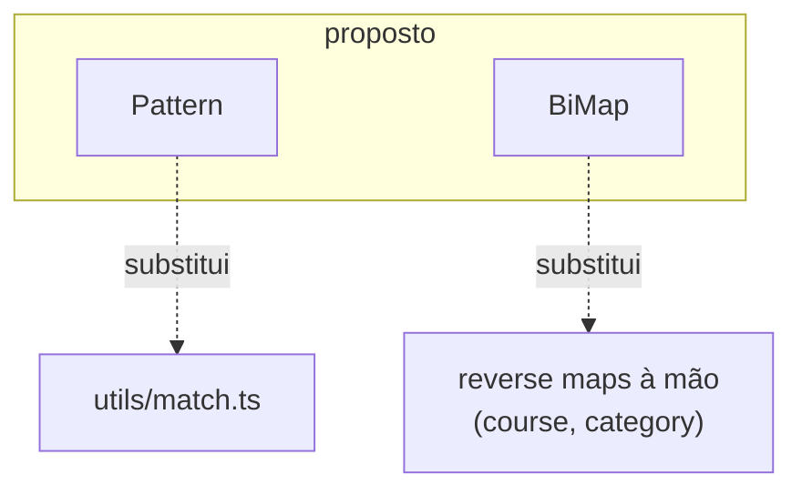

# Proposta — Pattern + BiMap

**Estado:** BiMap aprovado (etapa 9). Pattern aprovado (etapa 10).

Complemento ao [ROADMAP](./ROADMAP.md).

Dois módulos, uma origem: uma discussão sobre representar constantes de domínio sem `enum`. Saíram duas peças distintas — uma já prevista no ROADMAP (Pattern), outra nova (BiMap). São independentes: aprovar uma não obriga a outra.

---

## Critérios que herdam do ROADMAP

Nada aqui inventa regra. Cada módulo é medido pelo filtro que já existe:

1. **Substitui, não soma** — entra se apaga código solto do host, não se acrescenta capacidade nova.
2. **Há consumidor** — dor repetida, com call sites reais hoje. Sem consumidor, não abre.
3. **Três planos** — A lib (adaptar + testes), B doc (`docs/<módulo>/` + cobertura + sidebar), C host (1–2 consumidores fora da SDK).
4. **Autocontenção** — a doc do módulo só refere `src/$stdlib/`; exemplos genéricos, não tour desta app.
5. **Forma de erro** — `throw` no caminho feliz e pré-condição; `Result` quando o consumidor ramifica.

A tabela de fim mostra, módulo a módulo, que os cinco estão satisfeitos.

---

## Módulo A — Pattern

O ROADMAP já prevê Pattern em *«Mais tarde — substituir, não somar»*: **«`match` / `when` — só se o plano A substituir `utils/match.ts`. `define` e `enum` ficam de fora até haver consumidor.»** Esta proposta concretiza esse item e fixa o corte.

### Papel + em vez de

Casar um valor contra ramos, como valor. **Em vez de** [`utils/match.ts`](../../utils/match.ts) — o `match` / `when` soltos que já existem no host, sem tipos apertados e com semântica inconsistente.

### Entra

- **`match(value, cases)`** — valor literal → resultado, com fallback `_`. Substitui `match` do `utils`.
- **`when(value).is(pred, r).else(r)`** — condições em cadeia, resultado lazy quando função. Substitui `when` do `utils`.

### Fica de fora (até haver consumidor)

- **`enum`** — o codebase tem **zero** declarações `enum` TS. Sem consumidor, é canhão: lookup bidirecional + bitflags + array→numérico + camada de tipos colada por `as unknown as`. O ROADMAP já o adia; esta proposta mantém o adiamento. O manejo bidirecional de records tem resposta melhor no Módulo B.
- **`define`** — idem, sem consumidor.

### Correcções obrigatórias no plano A

O dump que circula tem três defeitos que **não** entram:

1. **`match` e `when` discordam sobre função-resultado.** `when` chama a função com o valor; `match` devolve-a sem chamar — mas o próprio exemplo do `match` mostra `() => activate()` como se disparasse. Uma regra só, aplicada aos dois.
2. **Overload `any` no `.is()`** — a forma «valor directo» aceita `any` e não confere contra `T`. A forma valor = `T`.
3. Manter o acerto que o dump já tem: `matched: { value } | undefined` distingue «casou com `undefined`» de «não casou». Preservar.

### Consumidor (plano C)

`utils/match.ts` tem base magra — hoje ~1 call site real (`when` em `CircularProgressbar`). É **tidy-up + substituição**, não dor aguda. Por isso Pattern entra *depois* de BiMap na ordem, e o plano C é fechar o `utils/match.ts` (trocar os call sites, apagar o ficheiro), não semear uso novo.

### Forma de erro

Sem `throw`. `match` devolve `R | undefined` (fallback ausente); `when(...).else(...)` é total. Nenhum ramo lança — é escolha de valor, não pré-condição.

---

## Módulo B — BiMap

Novo item, **não** está no ROADMAP. Justifica-se pelo mesmo filtro.

### Papel + em vez de

Um record com duas ou mais codificações do mesmo conceito, resolvido nos dois sentidos a partir de **uma** fonte. **Em vez de** objectos paralelos + mapas reversos à mão que têm de ser mantidos em sincronia.

### A dor, concreta

Em [`$sdk/course/wire.ts`](../../$sdk/course/wire.ts) a identidade de «obrigatoriedade» está espalhada por **quatro** declarações que se sincronizam à mão:

```
PERMISSION_IDENTIFIERS   key → código   { MANDATORY:'MANDA', … }
PERMISSION_LEVELS        key → número   { MANDATORY: 2020,   … }
wireIdToLevelId          código → número (à mão)
domainKeyToLevelId       key → número   (Object.entries().reduce())
```

As três últimas derivam das duas primeiras. Manter os reversos à mão **é** o drift à espera: um 4º nível obriga a tocar em quatro sítios, e a conversão fica muda se esquecer um. [`$sdk/category/constants.ts`](../../$sdk/category/constants.ts) repete a forma: `CATEGORY_TYPES` (código) + `CATEGORY_TYPE_IDS` (número) + `getCategoryTypeId` num sentido só.

### Fachada (plano A)

Column-agnostic — nada do domínio vaza para o primitive. O nome da coluna é **argumento**, conferido contra a linha inferida:

```ts
const map = BiMap.rows({
  MANDATORY:   { code: 'MANDA', levelId: 2020 },
  RECOMMENDED: { code: 'ADVIS', levelId: 2021 },
  OPTIONAL:    { code: 'OPTIO', levelId: 2022 },
});

map.get('MANDATORY').levelId    // 2020            — forward é só o dado
map.keyBy('code', 'MANDA')      // 'MANDATORY'     — reverso derivado
map.keyBy('levelId', 2020)      // 'MANDATORY'
map.keyBy('levelId', 9999)      // erro de tipo
map.keys                        // ('MANDATORY'|…)[]
map.column('code')              // ('MANDA'|…)[]
map.has(x)                      // narrowing
```

Tipos estruturais, não nominais: `code` é `'MANDA'|'ADVIS'|'OPTIO'`, subtipo de `string` — o valor que vem do `fetch` entra com `has()`, sem cast. O oposto do atrito de `enum`.

### A fronteira — o que BiMap NÃO engole

É o que o impede de virar o `enum` recusado no Módulo A:

- **Geração de nomes** (`byLevelId` via template-literal + Proxy) — não. O nome bonito é vocabulário do domínio; mora num wrapper de 1 linha em `wire.ts`, não no primitive.
- **Tabela de aliases** (`OBRIGATORIO`, `ADVISORY`, …) — normalização fuzzy de input humano, muitos→um. Fica no domínio.
- **Classificador muitos→um** (`toEnrollmentStatusPhase`: 8 códigos → 5 fases) — é um *fold* com default, forma diferente. Se recorrer, é outro primitive (`classify`), não BiMap.
- **Mapa de DTO inteiro** (`toUserSummary(wire)`) — fora de escopo; BiMap é escalar↔escalar.

### Porque módulo, não `Obj.biMap`

O ROADMAP diz «o que sobrar cabe em Str, Obj, Type ou Task». BiMap não sobra ali: é uma **entidade com estado** (guarda os índices reversos), construída por fábrica e devolvida como instância — como Cache, não como as funções puras de Obj. Módulo próprio.

### Consumidor (plano C)

Dois hoje, o limiar do ROADMAP para abrir: **`course`** (permissão, colapsa as 4 declarações em 1) e **`category`** (tipos + IDs numéricos). O plano C reescreve o cluster de permissão do `course` sobre BiMap — antes/depois real — e apaga `wireIdToLevelId` + `domainKeyToLevelId`. Aliases e resolução de objecto solto **ficam** em `wire.ts`.

### Forma de erro

- `BiMap.rows(...)` **lança** se uma coluna indexada tiver valor duplicado (pré-condição: coluna reversível é única). Transforma um reverso mudo em erro na carga.
- `keyBy(col, val)` devolve `keyof T | undefined` — o consumidor ramifica.

---

## Encaixe



Ambos isolados: Pattern não depende de nada; BiMap não depende de nada (guards internos, sem Type). Nenhum toca `$sdk/queries.ts`.

---

## Critérios × módulos

| Critério | Pattern | BiMap |
|----------|---------|-------|
| Substitui, não soma | `utils/match.ts` (apaga o ficheiro) | reversos à mão em `course`/`category` |
| Há consumidor | ~1 (`CircularProgressbar`) — tidy-up | 2 (`course`, `category`) — limiar ok |
| Três planos | A: corrigir dump; B: `docs/pattern/`; C: fechar `utils/match` | A: fábrica + validação; B: `docs/bimap/`; C: reescrever permissão do `course` |
| Autocontenção | exemplos `Pattern.match(...)`, sem host | exemplos `BiMap.rows(...)`, sem host |
| Forma de erro | sem throw (escolha de valor) | throw na carga (duplicado); `undefined` no lookup |

---

## Ordem sugerida

1. **BiMap primeiro** — dor mais aguda (drift real hoje), 2 consumidores, substituição com antes/depois nítido.
2. **Pattern depois** — tidy-up do `utils/match.ts`, menor urgência.

Cada um segue os três planos em Plan mode, um de cada vez. Esta proposta não é o plano A: é o que se aprova antes de o abrir.

---

## Por decidir (para quem aprova)

- **BiMap** entra como etapa 9 do ROADMAP, ou fica em «Mais tarde» até o 2º consumidor ser reescrito?
- **Pattern** — vale o tidy-up com só ~1 call site, ou espera-se um 2º consumidor de `when` antes de fechar `utils/match.ts`?
- Nome: **BiMap** (termo de CS, bidirecional) vs. algo mais próximo do domínio (`Codec`, `Lookup`). BiMap descreve o núcleo; a forma `rows` (N codificações) é o caso maior.
