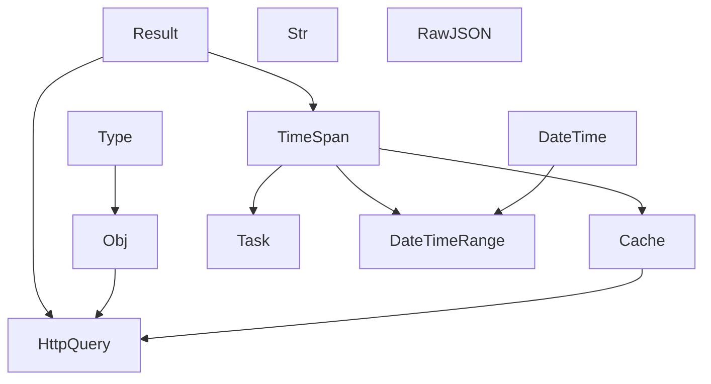

# Roadmap — `$stdlib`

Este ficheiro define **como** a pasta se completa e **o que não entra**. Não substitui a leitura dos módulos: é o mapa, o filtro e as regras de escrita.

A documentação humana vive aqui, ao lado do código. Copiar o directório da `$stdlib` leva os primitives e a leitura.

---

## Porque esta pasta existe

`$sdk` é o contrato Neolude. Utils, helpers e `_example` dentro da SDK misturam JS genérico com HTTP de produto. A `$stdlib` é a unidade portável para o segundo: JavaScript que qualquer host imaturo volta a escrever mal.

Fonte do dump (não é dependência runtime): primitives do mini-stack e o que estava em `$sdk/_example/` — agora em [`_incoming/`](../_incoming/). O código público vive **neste** repo; cada etapa adapta o dump, não o copia inteiro.

---

## Unidade portável

```
src/$stdlib/
  <módulo>/     código + testes
  docs/         esta leitura + ROADMAP.md (+ site VitePress)
  README.md     aponta para docs/
  _incoming/    dump — não é API pública
```

Import no host: `@/$stdlib/...` (alias `@` → `src`). A doc dos módulos **não** trata o alias como parte do contrato.

---

## Como escrever (leitura primeiro)

Narrativa primeiro, tabela depois. Um ficheiro responde a uma pergunta (“como representar um intervalo?”), não lista a pasta do código. Qualidade de prosa: skill `dev-lib-docs`. **Este** ficheiro = processo e cobertura. Os módulos documentados não citam a skill.

Exemplos ilustram o contrato (`Result.ok()`, `TimeSpan.parse('5m')`, `DateTimeRange.from(start, end)`). Não são um tour nesta SPA.

Cada README de módulo já documentado:

1. **Papel** + **em vez de** — o padrão solto que isto substitui (`setTimeout` sem id, `Map` no store, função duma toolkit).
2. **Situação** em prosa **antes** do primeiro bloco — o trabalho que o leitor reconhece, nomes genéricos (`listItems()`, `'5m'`).
3. **Dois** blocos copiáveis no how-to (caminho feliz + borda), só a fachada.
4. Bordas **no H2 onde pertencem**, colhidas dos testes — não uma tabela «erros» no fundo.

### Heurística de ficheiros por módulo

Cada módulo tem **os ficheiros que o descrevem**, nem um a mais por simetria.

| Sinal no código | Ficheiro |
|-----------------|----------|
| Módulo pequeno (fábricas + 4–8 métodos) | só `README.md` |
| Tipos e constantes que se consultam sozinhos | `data.md` |
| Conceito com regras + testes próprios | `<conceito>.md` |

Result, TimeSpan e DateTimeRange provavelmente cabem num `README.md` cada. HttpQuery pode precisar de `api.md` se o contrato de cache/retry não couber no README. Nada disso se amarra a um ecrã concreto do host.

---

## Autocontenção

A doc de um módulo **não depende** do host para fazer sentido. Refs e menções ficam na unidade portável (este directório + o código ao lado).

**Permitido**

- Links para outros ficheiros em `docs/`
- Caminhos e símbolos do código da `$stdlib`
- Exemplos genéricos (`Result.ok()`, `TimeSpan.parse('5m')`, `DateTime.now()`)

**Proibido** na doc humana dos módulos

- Paths de um host concreto (features, views, stores, `main.ts`, componentes)
- Links para docs irmãs do host, skills de agente ou regras de editor
- Tabelas de “quem consome isto nesta app”
- Tratar Vue, Pinia, i18n ou um alias de import como parte do contrato

Este `ROADMAP.md` (processo) pode falar do trabalho local — incluindo o plano C (host). Os módulos documentados, não.

---

## Processo: três planos por etapa

Quando alguém pedir para actuar numa etapa (“vamos na etapa Result”, “documenta TimeSpan”, “etapa 3”):

1. **Abrir Plan mode** antes de escrever código ou markdown.
2. Abrir **três planos isolados** (não um monolito):

   | Plano | Destino | Faz | Não faz |
   |-------|---------|-----|---------|
   | **A — lib** | `src/$stdlib/<módulo>/` | Adaptar o dump ao TypeScript desta base; testes Vitest colocalizados | Ligar stores; copiar o dump sem corte |
   | **B — doc** | `src/$stdlib/docs/<módulo>/` | Leitura humana; cobertura no [README](./); linha na skill [stdlib](../../../.claude/skills/stdlib/SKILL.md); entrada na sidebar de `.vitepress/config.ts` | Citar features/host; copiar a doc para a skill |
   | **C — host** | `$features`, `$stores`, `utils`, `env-config` | 1–2 consumidores **fora** da SDK, opt-in | Ligar `$stdlib` dentro de `$sdk/queries.ts`; apagar `es-toolkit` nesta etapa |

3. Etapa 0 não tem plano C (só a caixa).
4. AbortSignal no retry/query **não** é etapa própria: entra no plano A de Cache/HttpQuery ou Task **se** o consumidor for `fetch` de verdade.
5. Só depois da confirmação: implementar. Não escrever a tabela de etapas sem o plano A da etapa pedida.
6. Refs da doc dos módulos só dentro da raiz da `$stdlib`.
7. Acrescentar o módulo na sidebar de `.vitepress/config.ts` (`/<módulo>/`, depois cada ficheiro se houver mais que o README). Links internos: `(../result/)`, `(data.md)`; **não** `README.md` no href.
8. Ver no site: `npm run docs:stdlib`. Os markdown dos módulos **não** citam o gerador do site.

Não usar o template de documentação de fluxo de feature. Esse template não descreve um contrato reutilizável.

---

## Forma de erro

- **throw** — caminho feliz e pré-condição (`TimeSpan.parse`, `Type.assert`, `dividedBy(0)`).
- **Result (`try*`)** — o consumidor ramifica (`TimeSpan.tryParse`, `Result.try` / `tryAsync`).

---

## Filtro: o que vale

Critério: entra se há dor repetida. **Substituir, não somar** — o destino é o host deixar de precisar de `es-toolkit`. Cada símbolo mapeia para um módulo já no ROADMAP; não se copia o toolkit para dentro de `Str`. O critério por símbolo — casa única, consumidor vivo, corte da fachada — e a jurisprudência: [DX.md](DX.md).

Ainda não duplicar o que o host já resolve noutro sítio estável: `utils/date-time.ts`. Persistência no browser (`localStorage` / cookies) é a Storage da `$stdbrowser`, não um módulo desta pasta.

### Entra

- **Result, TimeSpan, Type, Obj, Cache, HttpQuery, Task, Str, RawJSON, BiMap, Pattern** — erro como valor, TTL, chave de cache, casing, `"true"` em env, tabela bidireccional, pattern matching.
- **DateTime (mínimo)** — factories (`create` / `now`) e comparação. O Range precisa disto. Não o dump de 610 linhas; não substituir `utils/date-time.ts` na mesma etapa.
- **DateTimeRange** — primitiva semântica de intervalo: dois instantes, não uma duração.

```text
TimeSpan        duração              <──── 3 horas ────>
DateTimeRange   dois pontos no tempo [start ──────── end]
range.duration  → TimeSpan
```

API pequena no começo: `from`, `start` / `end`, `duration`, `contains`, `overlaps`, `isBefore` / `isAfter`, `intersect`. O resto (union, expand, bounds half-open) descobre-se no plano A com uso.

**Não** inventar um módulo `Scheduler`: Task já é timers (`wait` / `every`); DateTimeRange é o “entre estes dois momentos”. **Não** inventar um módulo `Num` / lodash-lite: o que sobrar do toolkit cabe em Str, Obj, Type ou Task, ou fica um one-liner no host.

### Substituir `es-toolkit`

O reexport em `utils/es-toolkit.lib.ts` some quando **não restar símbolo**. Cada etapa C troca 1–2 call sites; o pacote só sai no fim. O dump de `Str` (`slugify` / `isEmpty` / `format`) **não** é o inventário — o plano A da etapa Str corta pelo uso real.

| Símbolo hoje no host | Módulo | Quando |
|----------------------|--------|--------|
| `debounce` | Task | etapa 4 |
| `kebabCase`, `camelCase`, `capitalize` | Str | etapa 5 |
| `omit`, `omitBy`, `clone`, `isEqual` | Obj (alargar; `omit` já existe) | depois da 5, se o plano A justificar |
| `isNil` | Type (`isNullOrUndefined`) | opt-in no host, sem etapa nova |
| `memoize` | Task (alargar) | depois da 4, se o plano A justificar |
| `at`, `randomInt` | one-liner no host, ou Obj se o plano A achar que não é one-liner | não abrir módulo |

`slugify` / `truncate` / `template` do dump só entram no plano A da Str se houver consumidor. `Str.isEmpty` é só string; não há empty genérico no Type.

### Mais tarde — substituir, não somar

- **Obj / Task (alargar)** — o resto da tabela `es-toolkit` acima; não é etapa Str.
- **Path** — `join` (hoje `utils/path.ts`) + `expand` (`:userId`, o que o Fetcher em `$stdbrowser` tem privado). Entra quando houver **dois** consumidores (Fetcher deixa de carregar o expand; `env-config` / `NeoludeSDK.resolveUrl` passam a `join`). Sem `basename`/`extname` do Node. Sem etapa própria neste ciclo. `$stdbrowser` pode depender da `$stdlib`; o contrário não.

### Não entra neste ROADMAP

- Dump DateTime (“substitui date-fns”)
- **Device** — sniff de UA
- **Scope** — DI tipo Inversify; ids de UI ficam no host (Vue)
- Consumidores **dentro** de `$sdk/` — excepto **wire/constants** quando o primitive elimina mapas reversos à mão (plano C da etapa BiMap); não ligar `$stdlib` em `$sdk/queries.ts`

---

## Encaixe



HttpQuery usa `Result` em vez de `{ data, error }`. TTL aceita `TimeInput` (`"5m"`). `TimeSpan.tryParse` devolve `Result`; `parse` lança. Chave via `Obj.identity` (mais fundo que o `identity` de um nível em `_incoming/http-query.ts`). DateTimeRange assenta em DateTime + TimeSpan, não em `Date` nativo.

---

## Etapas

Ordem por dependência. A estimativa **não** é o inventário final — o plano A de cada etapa confirma o corte.

| Etapa | Módulo(s) | Dor | Ajuste (plano A) | Host (plano C, exemplos) |
|-------|-----------|-----|------------------|---------------------------|
| **0** | Caixa | “utils vs helpers vs sdk vs quê?” | Pasta, README, este ROADMAP; dump em `_incoming/` | Link no README da SPA |
| **1** | Result, TimeSpan | Erro como valor; `300000` ilegível | Tuple Go-style; `TimeSpan.parse` | Quase nenhum. TimeSpan nas etapas 3–4 e 8 |
| **2** | Type, Obj | `typeof null`; chave de cache instável | Guards + `assert`; `Obj.identity` para params de listagem | Opcional: só se Type substituir um `isFilledArray` sem churn |
| **3** | Cache, HttpQuery | Dois GET iguais à rede | Adaptar `_incoming`; **um** contrato (`T` ou `Result`) na fachada; `clear` nos testes | Um sítio opt-in (ex.: listagem de catálogo). `refetch` → `invalidatePrefix`. Não SDK |
| **4** | Task | debounce/retry/timers sem id | `wait` / `every` / `debounce` / `retry`; `cancelAll` em testes | Trocar 1–2 `debounce` de `$utils` (primeira fatia do `es-toolkit`). Não o menu que usa VueUse de propósito |
| **5** | Str | kebab/camel/capitalize no host | Casing + o que o dump tiver consumidor; **não** omit/isEmpty/lodash | 1–2 call sites (`kebabCase` / `camelCase` / `capitalize`). Sem apagar o pacote |
| **6** | RawJSON | `"true"` / `"12"` em env | Alinhar com o parse de env do host; não duplicar para sempre | `env-config` usa RawJSON **ou** reexport |
| **6.5** | Consolidação do MVP | Bugs de semântica e singleton global no `Task` | `Object.hasOwn` em Pattern/BiMap; `signal` no HttpQuery handler; `Map`/`Set`/`RegExp` no `Obj.identity`; `TaskScheduler` instanciável; retry com uma assinatura | Migrar 1–2 call sites de `Task.retry` para handler com signal |
| **7** | DateTime (mínimo) | Range precisa de instante | Factories + comparação; **não** o dump; **não** substituir `utils/date-time.ts` | Nenhum, ou só o que o plano A da 8 precisar na borda |
| **8** | DateTimeRange | `{ start, end }` repetido | API pequena (lista acima). Bounds inclusivos/exclusivos neste plano | Calendário / janela de busca na borda (`Date` → `DateTime`). SDK intocada |
| **9** | BiMap | Mapas paralelos + reversos à mão | `BiMap.rows`, `get`, `keyBy`, `has`; throw em duplicado na carga | Wire/constants da SDK (ex.: codificações escalar↔escalar). Não `queries.ts` |
| **10** | Pattern | `match` / `when` soltos | `Pattern.match`, `Pattern.when` (fluent + array); sem `enum`/`define` | Fechar `utils/match.ts` (ex.: componente com estado reactivo) |

Depois, só se o plano A justificar: alargar Obj/Task para o resto do `es-toolkit`, alargar DateTime. O pacote `es-toolkit` sai quando a tabela acima estiver vazia.

Não ligar `$stdlib` dentro de `$sdk/queries.ts` nesta fase.

### Qualidade TypeScript (host)

- **`noUncheckedIndexedAccess`** — activo em `tsconfig.app.json`. Indexação (`obj[key]`, `arr[i]`) devolve `T | undefined`; tratar com guards ou optional chaining.

---

## Critério de “módulo documentado”

Um módulo está documentado quando um leitor que **não** conhece o host consegue:

1. dizer o que o primitive é e quando usá-lo;
2. chamar a fachada (`Result.ok()`, `DateTimeRange.from(...)`) com os tipos certos;
3. usar os comportamentos não óbvios (TTL, overlap, `identity`);
4. seguir links só dentro da raiz da `$stdlib`.

Enquanto a etapa correspondente estiver pendente, a cobertura no [README](./) diz isso em voz alta. Não há meia-doc disfarçada de completa.
