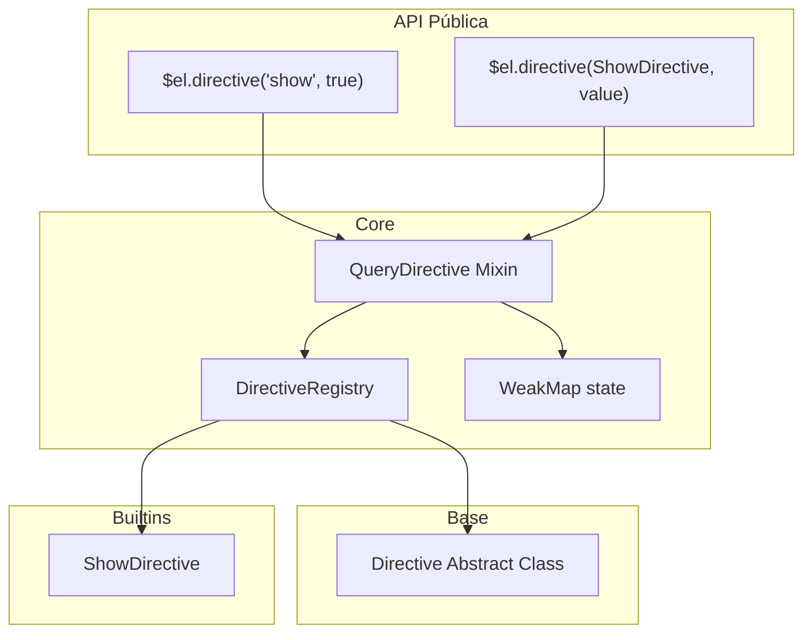

# Sistema de Diretivas - my-query v2

## Visão Geral

Implementação de um sistema de diretivas class-based integrado ao my-query via Mixin, seguindo o padrão já utilizado pela biblioteca.

## Arquitetura



## Estrutura de Arquivos

```
src/
├── types/
│   └── directive.ts           # Tipos e interfaces
└── modules/
    └── my-query/
        ├── directive.ts        # Classe abstrata base
        ├── directive-registry.ts  # Registro estático
        ├── query-directive.ts  # Mixin principal
        └── directives/
            └── show.ts         # Diretiva built-in
```

## Componentes

### 1. Tipos (`src/types/directive.ts`)

```typescript
// Interface para sistema reativo (duck typing)
export interface ReactiveSource<T = any> {
  subscribe: (callback: (value: T) => void) => () => void;
  getValue?: () => T;
}

// Instância de diretiva gerenciada
export interface DirectiveInstance<T = any> {
  id: string;
  name: string;
  directive: DirectiveClass;
  value: T;
  unsubscribe?: () => void;
}

// Extensão da interface IMyQuery
export interface IQueryDirective<T extends Element> {
  directive(name: string, value?: any): this;
  directive(directive: DirectiveClass, value?: any): this;
}
```

### 2. Classe Abstrata Base (`src/modules/my-query/directive.ts`)

```typescript
export abstract class Directive<T extends Element = HTMLElement, TValue = any> {
  constructor(public readonly element: T) {}
  
  mount(value: TValue): void {}
  update(value: TValue): void {}
  unmount(): void {}
}
```

### 3. Registry (`src/modules/my-query/directive-registry.ts`)

```typescript
export class DirectiveRegistry {
  static register(name: string, directive: DirectiveClass): typeof DirectiveRegistry;
  static get(name: string): DirectiveRegistry | undefined;
  static has(name: string): boolean;
}
```

### 4. Mixin (`src/modules/my-query/query-directive.ts`)

```typescript
export function QueryDirective<T extends Element>(): 
  new (element: T) => IQueryDirective<T> {
  
  // WeakMap<Element, Map<string, DirectiveInstance>>
  // Métodos: .directive(name, value)
  // Suporte a ReactiveSource via duck typing
}
```

### 5. Exemplo Builtin (`src/modules/my-query/directives/show.ts`)

```typescript
export class ShowDirective extends Directive<HTMLElement, boolean> {
  mount(value: boolean): void {
    this.update(value);
  }
  
  update(value: boolean): void {
    this.element.style.display = value ? '' : 'none';
  }
  
  unmount(): void {
    this.element.style.display = '';
  }
}
```

## Integração com MyQuery

```typescript
import { Mixin } from 'ts-mixer';
import { QueryDirective } from './my-query/query-directive';

class MyQuery<T extends Element>
  extends Mixin(
    QuerySelection,
    QueryManipulation,
    QueryUtils,
    QueryEventHandler,
    QueryDirective,  // NOVO
  )
  implements IMyQuery<T>
{}
```

## Uso

```typescript
// Usar diretiva registrada
$el.directive('show', true);
$el.directive('show', false);

// Usar classe diretamente
$el.directive(ShowDirective, true);

// Com reactive source
const signal = createSignal(true);
$el.directive('show', signal); // duck typing - verifica .subscribe()

// Atualizar valor
$el.directive('show', false); // chama update() na instância existente
```

## Integração com Primitivos

Usar `Type` do `@/modules/primitives`:
- `Type.isFunction(v)` - para detectar subscribers
- `Type.isObject(v)` - para validar inputs

## Detalhes de Implementação

### Reactive Detection (Duck Typing)

```typescript
const isReactive = (value: any): value is ReactiveSource => {
  return Type.isFunction(value?.subscribe);
};
```

### Lifecycle com Reactive

```typescript
if (isReactive(value)) {
  instance.unsubscribe = value.subscribe((newValue) => {
    instance.directive.update(newValue);
  });
}
```

### Armazenamento com WeakMap

```typescript
// Evita memory leaks - diretivas são coletadas quando elemento é removido
private static readonly _directives = new WeakMap<Element, Map<string, DirectiveInstance>>();
```
