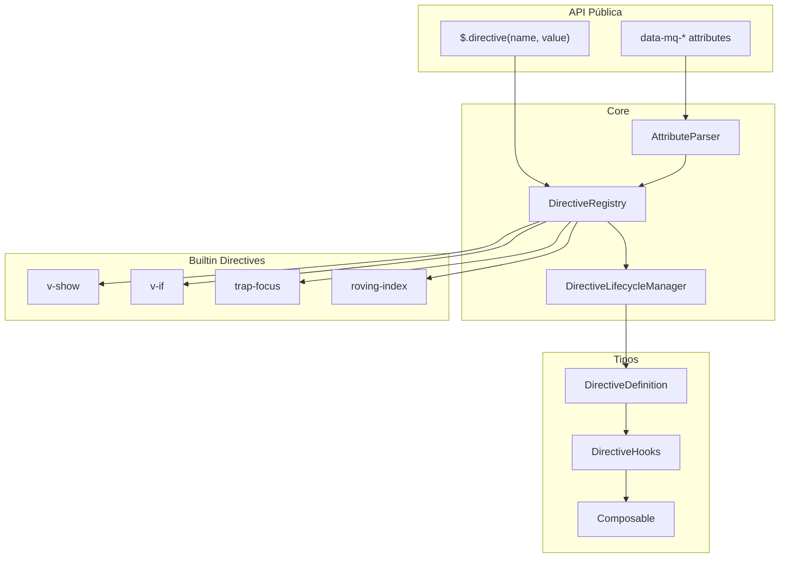

# Sistema de Diretivas - my-query

## Visão Geral

O sistema de diretivas permite criar comportamentos reativos nos elementos DOM,类似的 ao Vue.js directives. Suporta uso declarativo (atributos data-) e programático (método chain).

## Arquitetura Proposta



## Tipos Base

### DirectiveObject

```typescript
type DirectiveObject<T extends Element = HTMLElement> = {
  mounted?: (el: T, binding: DirectiveBinding) => void;
  updated?: (el: T, binding: DirectiveBinding, oldValue: any) => void;
  unmounted?: (el: T, binding: DirectiveBinding) => void;
  created?: (el: T, binding: DirectiveBinding) => void;
};
```

### DirectiveFunction

```typescript
type DirectiveFunction<T extends Element = HTMLElement> = (
  el: T,
  binding: DirectiveBinding,
) => DirectiveObject<T> | void;
```

### DirectiveBinding

```typescript
type DirectiveBinding = {
  value: any;
  oldValue: any | undefined;
  arg: string | undefined;
  modifiers: Record<string, boolean>;
  instance: DirectiveInstance;
};
```

### DirectiveInstance

```typescript
type DirectiveInstance = {
  id: string;
  name: string;
  el: Element;
  update: (newValue: any) => void;
  unmount: () => void;
  getSignal: () => any; // Optional reactive integration
};
```

## API de Composable

```typescript
// Exemplo de composable
function useTrapFocus(options: TrapFocusOptions) {
  return {
    mounted(el, binding) {
      // implementação
    },
    updated(el, binding, oldValue) {
      // implementação
    },
    unmounted(el, binding) {
      // cleanup
    }
  } as DirectiveObject;
}

// Uso programático
$el.directive(useTrapFocus, { trapped: true });

// Uso declarativo
// <div data-mq-trap-focus="trapped: true">
```

## Sistema de Binding Reativo (Pubsub)

```typescript
// Interface para integração com sistemas reativos externos
type Subscriber<T> = (value: T) => void;
type Unsubscribable = () => void;

interface ReactiveSource<T> {
  subscribe: (callback: Subscriber<T>) => Unsubscribable;
  getValue: () => T;
}

// Diretiva pode aceitar ReactiveSource como valor
$el.directive('v-show', reactiveSignal);
```

## Atributos Declarativos

Padrão: `data-mq-{directive-name}="{arg}: {value}, {modifiers}"`

Exemplos:
- `data-mq-show="true"` → v-show
- `data-mq-show="visible: true"` → v-show com arg
- `data-mq-if="isLoggedIn"` → v-if
- `data-mq-trap-focus="true"` → trap-focus
- `data-mq-trap-focus="modal: true"` → trap-focus com arg
- `data-mq-roving-index="activeIndex"` → roving-index

## Estrutura de Arquivos

```
src/modules/query-directive/
├── index.ts                 # Exportações
├── directive-types.ts       # Tipos TypeScript
├── directive-registry.ts   # Registro de diretivas
├── directive-lifecycle.ts  # Gerenciador de ciclo de vida
├── directive-parser.ts     # Parser de atributos
├── composables/
│   ├── index.ts
│   ├── use-trap-focus.ts
│   └── use-roving-index.ts
└── builtins/
    ├── index.ts
    ├── v-show.ts
    ├── v-if.ts
    ├── trap-focus.ts
    └── roving-index.ts
```

## Métodos na Interface IMyQuery

```typescript
interface IMyQuery<T extends Element> {
  // Usar diretiva registrada
  directive(name: string, value: any): this;
  
  // Usar composable diretamente
  directive(composable: DirectiveFunction, value?: any): this;
  
  // Obter instância de diretiva
  directive(name: string): DirectiveInstance | undefined;
}
```

## Integração com Sistema de Eventos

As diretivas podem usar o sistema de eventos existente:

```typescript
const myDirective = {
  mounted(el, binding) {
    const handler = () => {
      binding.instance.update(!binding.value);
    };
    
    el.addEventListener('click', handler);
    
    // Guardar referência para cleanup
    binding._eventHandlers = [{ event: 'click', handler }];
  },
  
  updated(el, binding) {
    // Reagir a mudanças
  },
  
  unmounted(el, binding) {
    // Cleanup de eventos
    binding._eventHandlers?.forEach(({ event, handler }) => {
      el.removeEventListener(event, handler);
    });
  }
};
```
